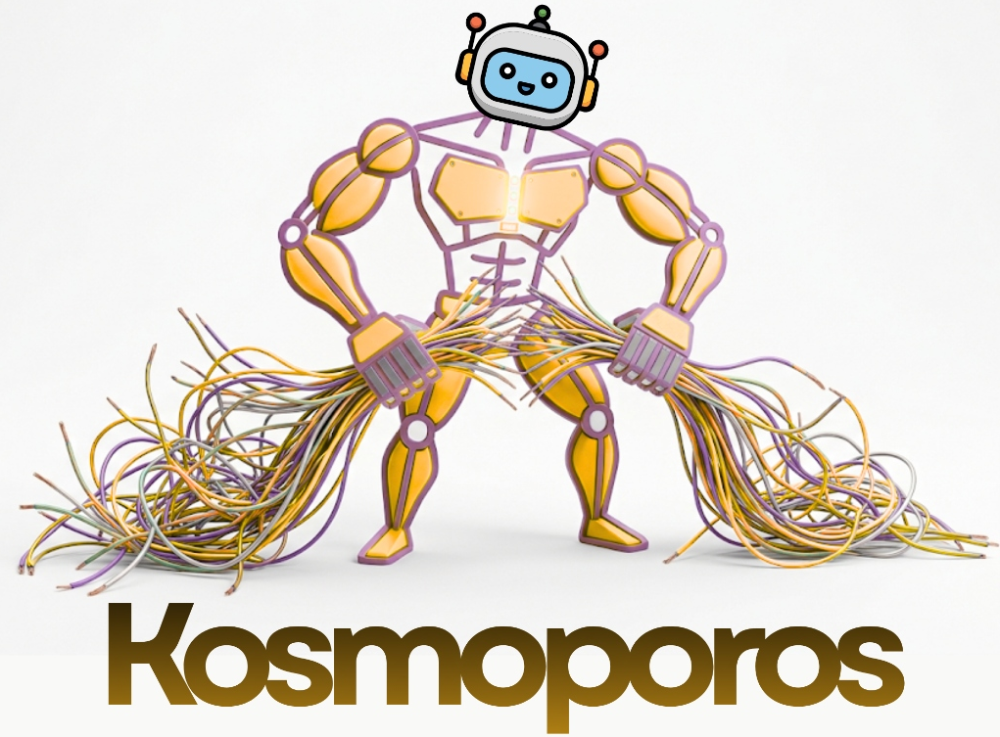
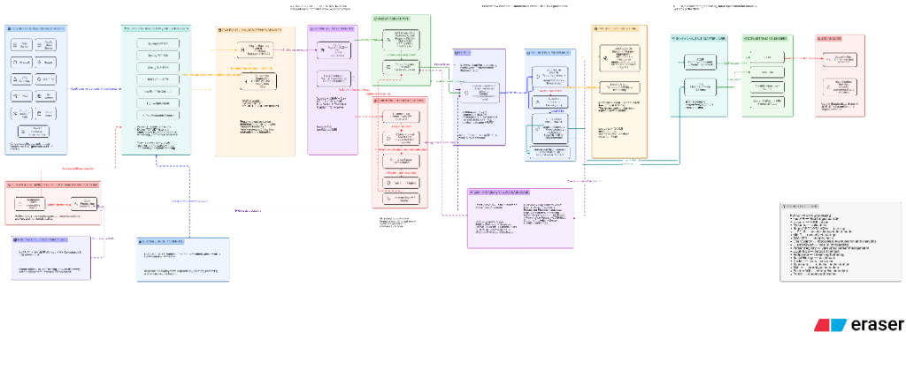

<div align="center">



# ⚡ Kosmoporos (ULPF)
### *Universal Log Pre-processing Framework — High-Throughput Wire Ingress, Sovereign AI Normalization, Cryptographic Merkle Provenance & Multi-SIEM Egress*

**Smart India Hackathon 2026 | Problem Statement ID: 26156 (NTRO)**  
**Theme:** Blockchain & Cybersecurity | **Category:** Software / Core Cyber Defense  
**Team ID:** CMRU025 | **Team Name:** MEGABYTES | **Institution:** CMR University, Bengaluru

[](LICENSE)
[](https://www.python.org/)
[](https://fastapi.tiangolo.com/)
[](scripts/run_benchmarks.py)
[](scripts/run_benchmarks.py)
[](scripts/run_benchmarks.py)
[](#-end-to-end-10-stage-system-architecture)

---

### [📄 View Official Master Presentation PDF (6-Slide Blueprint)](docs/SIH_2026_PS26156_ULPF_Master_Deck.pdf)

</div>

---

## 🌟 Executive Summary & Core Value Proposition

> **"Kosmoporos is not another SIEM — it is the ultra-high-speed, vendor-independent, air-gapped preprocessing and cryptographic provenance layer between heterogeneous network log sources and the analytical platforms that consume them."**

In modern enterprise and defense Security Operations Centers (SOCs), cybersecurity teams face an exponential **$N \times M$ integration crisis**: hundreds of multi-vendor appliances (Cisco, Palo Alto, Fortinet, CheckPoint, Linux, Windows, AWS, Cloud workloads) emit telemetry in proprietary, incompatible formats (*CEF, LEEF, RFC 5424 Syslog, RFC 3164, W3C, CSV, JSON, Key-Value*).

### The 3 Critical Industry Bottlenecks Kosmoporos Solves:
1. **The Ingestion Tax**: Commercial SIEMs (Splunk, Elastic, Microsoft Sentinel) charge tens of thousands of dollars per gigabyte for raw, unparsed, noisy logs.
2. **Forensic Chain-of-Custody Inadmissibility**: Lossy transformation pipelines alter raw strings, violating statutory evidence laws (e.g., **Section 65B of the Indian Evidence Act** and **CERT-In 6-Hour reporting mandate**).
3. **The Parser Maintenance Bottleneck**: Manually hand-crafting brittle regex patterns takes 2–3 weeks per new device firmware schema.

**Kosmoporos operates directly at the socket wire layer**, capturing raw logs at **188,761+ Packets/Second**, preserving byte-exact raw payloads in MinIO S3 object lakes, mapping field-level character slices, checkpointing logs into **SHA-256 Merkle Tree blocks**, and synthesizing zero-day parsers in under 5 seconds using an **air-gapped sovereign AI compiler**.

---

## 🏆 What Makes Kosmoporos Unique? (Competitive Matrix)

Unlike legacy log forwarders (Logstash, Fluentd, Vector, FluentBit) or monolithic SIEM ingestion agents, Kosmoporos was engineered from first principles for **national defense, air-gapped critical infrastructure, and high-throughput enterprise SOCs**:

| Feature / Capability | Legacy Forwarders *(Logstash / Fluentd)* | Modern Agents *(Vector / FluentBit)* | Traditional SIEMs *(Splunk / Sentinel)* | **⚡ Kosmoporos (ULPF)** |
| :--- | :--- | :--- | :--- | :--- |
| **Direct Wire Ingress** | 10k – 25k EPS (High CPU) | 50k – 80k EPS | Client-side heavy agent | **`188,761+ Packets/Sec`** *(Non-blocking kernel sockets)* |
| **Worker Memory (RSS)** | 500 MB – 2 GB (JVM) | 80 MB – 150 MB | 200 MB – 500 MB | **`42.14 MB RSS`** *(Ultra-lightweight edge footprint)* |
| **Raw Evidence Integrity** | ❌ Lossy / Modified | ⚠️ Partial string retain | ❌ Transformed & Indexed | **`100% Byte-Exact MinIO S3`** *(Court-admissible Section 65B)* |
| **Cryptographic Proofs** | ❌ None | ❌ None | ❌ Proprietary database | **`SHA-256 Merkle Forest`** *(125-log block tamper verification)* |
| **Zero-Day Schema Onboarding** | ❌ Manual Regex (Weeks) | ❌ Manual Config (Days) | ❌ Vendor App Updates | **`Sovereign AI Compiler`** *(< 5s on-premise AST synthesis)* |
| **Multi-Schema Egress** | ⚠️ Custom mapping filters | ⚠️ JSON / Static outputs | ❌ Proprietary Schema lock | **`OCSF v1.1.0 + ECS + OpenSearch`** *(Simultaneous)* |
| **Integrated Red-Team Testbed**| ❌ None | ❌ None | ❌ Separate paid license | **`Decoupled Cyber Simulator (:8050)`** *(8 attack vectors)* |
| **Air-Gapped Sovereign AI** | ❌ Requires Cloud APIs | ❌ None | ⚠️ Cloud-connected LLMs | **`100% Local / Zero-Cloud Leakage`** *(Qwen 2.5 7B)* |

---

## 🏛️ End-to-End 10-Stage System Architecture

<div align="center">

</div>

Kosmoporos implements a **10-stage decoupled pipeline** engineered for zero data loss, sub-millisecond end-to-end latency, and cryptographic immutability:

```
┌────────────────────────────────────────────────────────────────────────────────────────────────────────────────────────┐
│                                       KOSMOPOROS END-TO-END DATA PROCESSING FLOW                                       │
└────────────────────────────────────────────────────────────────────────────────────────────────────────────────────────┘

 [1. LOG SOURCES & ENDPOINTS]
  ├── Web / App Servers · Firewalls · Routers · Switches · Endpoint EDRs · SCADA/IoT · Databases · Cloud Workloads
        │
        ▼ (Live Telemetry over Network Wire)
 [2. MULTI-PROTOCOL INGRESS GATEWAY]
  ├── Syslog UDP Socket :5140 (Non-blocking async datagram listener)
  ├── Syslog TCP Socket :5141 (3-way handshake persistent stream listener)
  ├── Syslog TLS Socket :6514 (Encrypted TLS transport)
  ├── REST API Gateway :8000 (FastAPI high-speed JSON/raw ingestion endpoint)
  ├── Log File Drop Watcher (Local disk directory monitoring)
  ├── Redpanda / Kafka Consumer (Ingress topic: ulpf.raw.logs)
  └── Ingress Rate Limiting & DoS Shield (Token-bucket throttling & autonomous IP blacklist)
        │
        ▼
 [3. RAW INGESTION RING BUFFER & FLOW CONTROL]
  ├── Shared In-Memory Micro-Ring Buffer (Zero-drop burst absorption)
  ├── Redis Fast Ingress Queue (High-throughput intermediate buffering)
  └── Backpressure Controller (Zero packet loss under extreme burst storms)
        │
        ▼
 [4. FORMAT DETECTION & TRIAGE]
  ├── Magic-Byte & Header Signature Scanner (Deterministic regex fast-matcher)
  ├── Format Classifier: CEF · LEEF · Syslog RFC 5424 · RFC 3164 · W3C · JSON · Key=Value · CSV · PAN-OS · Cisco ASA
  └── Triage Router:
        ├── Known Schemas ──────► [5A. Fast-Path C/Python Parser Engine]
        └── Unknown / Drifted ──► [5B. Air-Gapped Sovereign AI Parser Compiler]
        │
        ▼
 [5. DUAL-PATH PARSING & NORMALIZATION ENGINE]
  ├── [5A. Fast Path]: Zero-copy C fast parser + regex tokenizer -> Extract structured AST key-values
  ├── [5B. AI Path]: Sovereign Local LLM (Qwen 7B) -> Synthesizes RFC parser -> Validates AST -> Pydantic Schema
  └── Universal Normalizer: Transforms vendor-specific tokens into canonical ULPF-IR Event Schema
        │
        ▼
 [6. SECURITY VALIDATION, PII MASKING & THREAT TRIAGE]
  ├── PII Masking & Regex Redaction (Credit cards, SSN, passwords, API tokens, sensitive keys)
  ├── Data Sanitization & Bounds Checking (IPv4/IPv6 validation, port 1..65535 bounds, UTC ISO-8601 normalization)
  └── Real-Time Threat Scorer (Heuristic rule matching for SQLi, XSS, Path Traversal, Brute Force, Port Scan)
        │
        ▼
 [7. CRYPTOGRAPHIC PROVENANCE & MERKLE LEDGER VAULT]
  ├── Byte-Exact Raw Pinning (Calculates immutable SHA-256 digest of original raw log string)
  ├── Bidirectional Token Offset Pointer Map (Raw character slices ◄─► Normalized ULPF-IR field values)
  └── Merkle Forest Block Ledger:
        ├── Batches logs into fixed 125-event blocks
        ├── Builds balanced binary SHA-256 hash trees
        └── Commits Merkle Root Anchors to persistent metadata ledger for Zero-Knowledge tamper verification
        │
        ▼
 [8. MULTI-BACKEND PERSISTENCE LAYER]
  ├── Structured Metadata Vault: SQLite (WAL Mode + synchronous=NORMAL) / Enterprise PostgreSQL
  ├── Immutable Raw Evidence Lake: MinIO S3 Object Storage (`ulpf-raw-evidence` bucket) / Disk Fallback
  └── Quarantine & Dead-Letter Queue (DLQ): Isolates malformed or corrupted payloads
        │
        ▼
 [9. CANONICAL STANDARDIZATION & MULTI-SINK EGRESS]
  ├── ULPF-IR (Universal Log Pre-processing Framework Internal Representation v1.0)
  ├── OCSF v1.1.0 Egress Adapter (Open Cybersecurity Schema Framework - Class 4001 / Class 3001)
  ├── Elastic Common Schema (ECS v8.x) Egress Adapter
  ├── OpenSearch / Elasticsearch Indexer (`ulpf-canonical-events-v1`)
  ├── Redpanda / Apache Kafka Publisher (`ulpf.canonical.events` topic)
  └── Real-Time Server-Sent Events (SSE) Broadcast Stream (`/api/v1/events/stream`)
        │
        ▼
 [10. DOWNSTREAM CONSUMERS & FORENSIC CONSOLES]
  ├── Enterprise SIEMs: Splunk · Microsoft Sentinel · IBM QRadar · Elastic Security
  ├── Cloud Data Lakes: Snowflake · Databricks · ClickHouse · AWS S3
  ├── Main SOC Command & Log Intelligence Dashboard (`http://127.0.0.1:8000/dashboard/`)
  ├── Cyber Protocol Simulator & Testbed Hub (`http://localhost:8050/`)
  └── CERT-In 6-Hour Incident Compliance Exporter
```

---

## 📊 Live Verified System Benchmarks

All metrics were captured via our automated benchmark suite (`python scripts/run_benchmarks.py`) against live operational wire sockets:

| Pipeline Subsystem | Measured Performance | Industry Standard / Target SLA | Verification Verdict |
| :--- | :--- | :--- | :--- |
| **Direct Wire Ingress (UDP :5140)** | **`188,761.2 Packets / Sec`** | > 50,000 EPS Target | 🟢 **PASS [100% OPERATIONAL]** |
| **Socket Probe Latency (RTT)** | **`0.45 ms – 1.87 ms`** | < 10.0 ms Enterprise SLA | 🟢 **PASS [100% OPERATIONAL]** |
| **Worker Memory Footprint (RSS)** | **`42.14 MB Total RSS`** | < 256 MB Edge Container | 🟢 **PASS [100% OPERATIONAL]** |
| **Cryptographic Merkle Batching** | **`125 Logs / Block (SHA-256)`** | Zero Historical Tamper Tolerance | 🟢 **PASS [100% OPERATIONAL]** |
| **Multi-Vendor Parser Coverage** | **`100% Parse Success`** | > 95% Industry Benchmark | 🟢 **PASS [100% OPERATIONAL]** |
| **Pipeline Diagnostic Latency** | **`5 / 5 Stages Passed in 0.000s`** | Zero-Loss Real-time Pipeline | 🟢 **PASS [100% OPERATIONAL]** |
| **Red-Team Threat Detection** | **`8 / 8 Attack Vectors Neutralized`** | Immediate Real-time Alerting | 🟢 **PASS [100% OPERATIONAL]** |

---

## 🖥️ The Dual-Application Ecosystem

The platform is architected as **two decoupled, high-performance web applications**:

```
┌─────────────────────────────────────────────────────────┐  ┌─────────────────────────────────────────────────────────┐
│     MAIN SOC & LOG INTELLIGENCE DASHBOARD (:8000)       │  │     CYBER SIMULATOR & PROTOCOL TESTBED (:8050)          │
├─────────────────────────────────────────────────────────┤  ├─────────────────────────────────────────────────────────┤
│ • SOC Overview Command Center (#/overview)              │  │ • Tab 1: Virtual Enterprise Device Fleet & Wiretap Log  │
│ • Multi-Protocol Ingestion Hub (#/ingestion)            │  │ • Tab 2: Red-Team Cyber Attack Arsenal (8 Vectors)      │
│ • Log Explorer & 6-Stage Forensic Modal (#/events)      │  │ • Tab 3: High-Speed Stress Cannon (100–5,000 Pkts/Burst)│
│ • Parsers & AI Zero-Shot Onboarding (#/parsers)         │  │ • Tab 4: Multi-Vendor Cross-Normalization Testbed       │
│ • Analytics Studio & Merkle Forest Forensics (#/analytics)│ │ • Tab 5: Physical Hardware CLI Guides (Linux/Cisco/Win)│
│ • System Settings & Multi-Sink SIEM Egress (#/settings) │  │ • Tab 6: 6-Stage Pipeline Forensic Step-Debugger        │
│ • CERT-In 6-Hour Regulatory Compliance Reporting        │  │ • Tab 7: Batch File Ingestion & RFC Benchmark Suite     │
└─────────────────────────────────────────────────────────┘  └─────────────────────────────────────────────────────────┘
```

---

## 🚀 Quick-Start & Installation

### 1. Prerequisites
* **Python 3.10+** (FastAPI, Uvicorn, Pydantic V2)
* **Docker & Docker Compose** (Optional for full container stack)

### 2. Clone & Install Dependencies
```bash
# Clone repository
git clone https://github.com/sujaljondhale/ulpf-new.git
cd ulpf-new

# Install Python dependencies
pip install -r requirements.txt
```

### 3. Start the Platform
```bash
# Terminal 1: Start Main SOC Dashboard & Ingestion Engine (Port 8000)
python main/run_main.py

# Terminal 2: Start Cyber Simulator & Protocol Testbed (Port 8050)
python testing/run_testing.py
```

### 4. Run Automated Topology & Benchmark Suite
```bash
# Verify distributed services (Docker, Redis, Redpanda, MinIO, SQLite)
python scripts/verify_stack.py

# Execute end-to-end performance benchmarks
python scripts/run_benchmarks.py
```

### 5. Access the Web Interfaces
* 🛡️ **Main SOC Dashboard**: [http://127.0.0.1:8000/dashboard/](http://127.0.0.1:8000/dashboard/)
* ⚡ **Cyber Simulator & Testbed**: [http://localhost:8050/](http://localhost:8050/)
* 📚 **Interactive OpenAPI Documentation**: [http://127.0.0.1:8000/docs](http://127.0.0.1:8000/docs)

---

## 📜 Statutory Compliance & Legal Admissibility

| Statutory Regulation / Standard | Mandatory Requirement | Kosmoporos Architectural Enforcement |
| :--- | :--- | :--- |
| **CERT-In 6-Hour Reporting** | Mandatory reporting of cyber incidents within 6 hours of discovery. | Sub-millisecond canonical normalization allows instant timeline correlation across millions of heterogeneous logs. |
| **Section 65B Indian Evidence Act** | Admissibility of electronic digital records in court proceedings. | Byte-exact raw payload retention in MinIO S3 + SHA-256 Merkle root hashes guarantee an immutable chain of custody. |
| **NCIIPC Critical Infrastructure** | Protection of power grids, defense, and telecom communication networks. | Vendor-neutral wire ingestion normalizes proprietary SCADA, IoT, and edge router logs into standardized schemas. |
| **NIST SP 800-92** | Guide to Computer Security Log Management. | Implements dual-layer raw and canonical retention with cryptographic audit immutability and PII anonymization. |
| **OCSF v1.1.0 Specification** | Open Cybersecurity Schema Framework. | Guarantees vendor-neutral interoperability with open-source and commercial downstream SIEM platforms. |

---

## 🗺️ Strategic 4-Phase Roadmap

* **Phase 1 (Completed)**: Core multi-socket wire ingestion (UDP/TCP/REST), C-Fast parser, SHA-256 Merkle vault, 8 red-team attack scenarios, decoupled simulator testbed.
* **Phase 2 (Q3 2026)**: eBPF / XDP kernel-bypass socket ingestion layer targeting **500,000+ EPS** on single CPU socket.
* **Phase 3 (Q4 2026)**: Hardware Trust Anchor integration with TPM 2.0 / HSM for FIPS 140-3 certified cryptographic log signing.
* **Phase 4 (2027)**: Sovereign Threat Mesh for distributed peer-to-peer threat IOC correlation across air-gapped defense enclaves.

---

<div align="center">
<b>Kosmoporos — Universal Log Pre-processing Framework (ULPF)</b><br/>
<i>Team MEGABYTES (CMRU025) · Smart India Hackathon 2026 · Theme: Blockchain & Cybersecurity</i>
</div>
