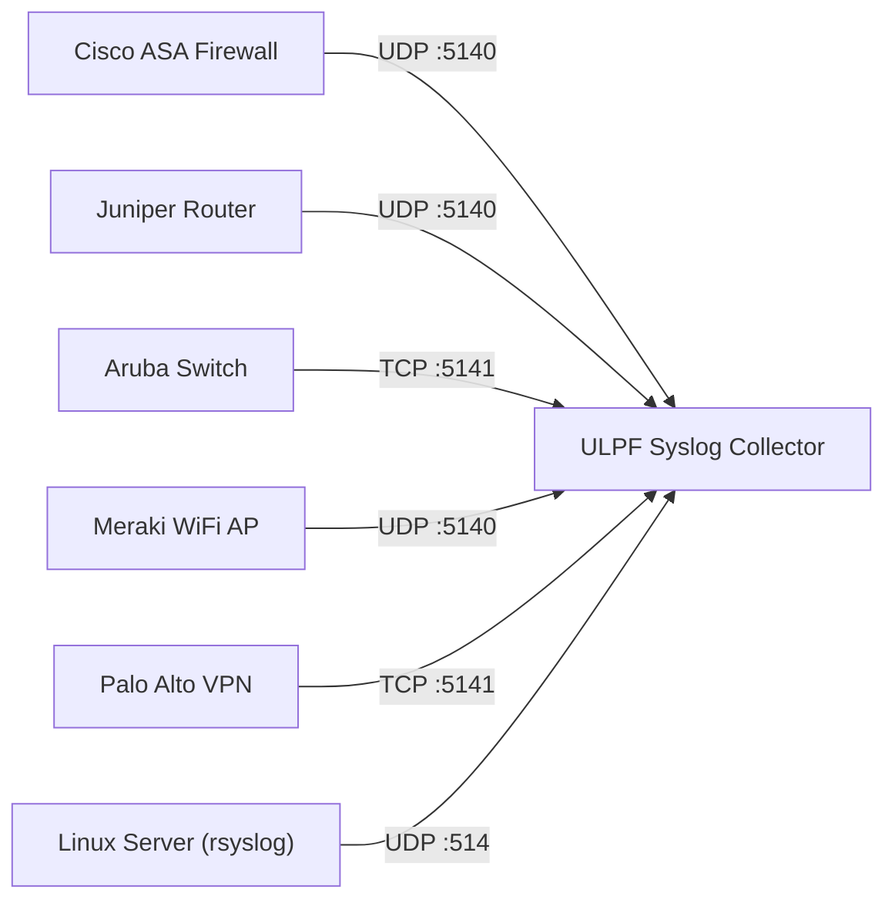
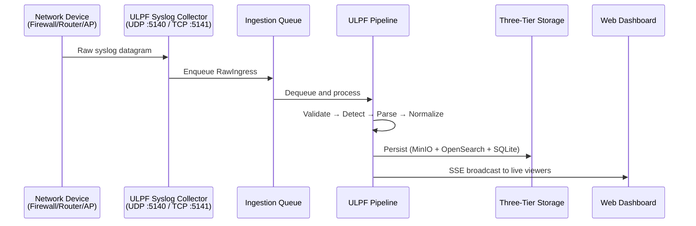
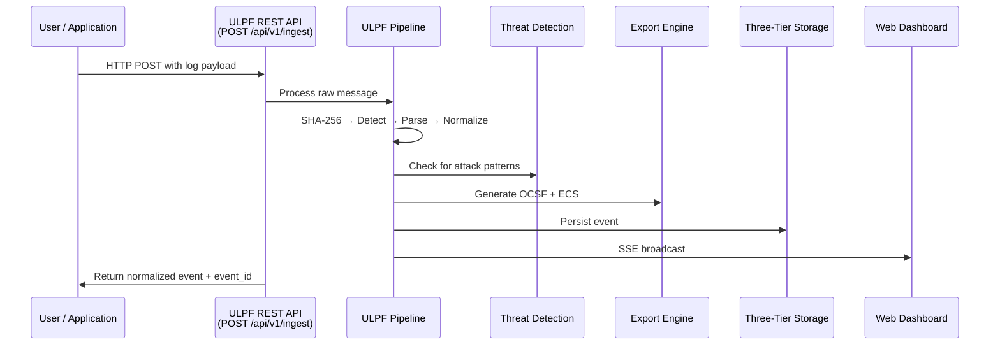
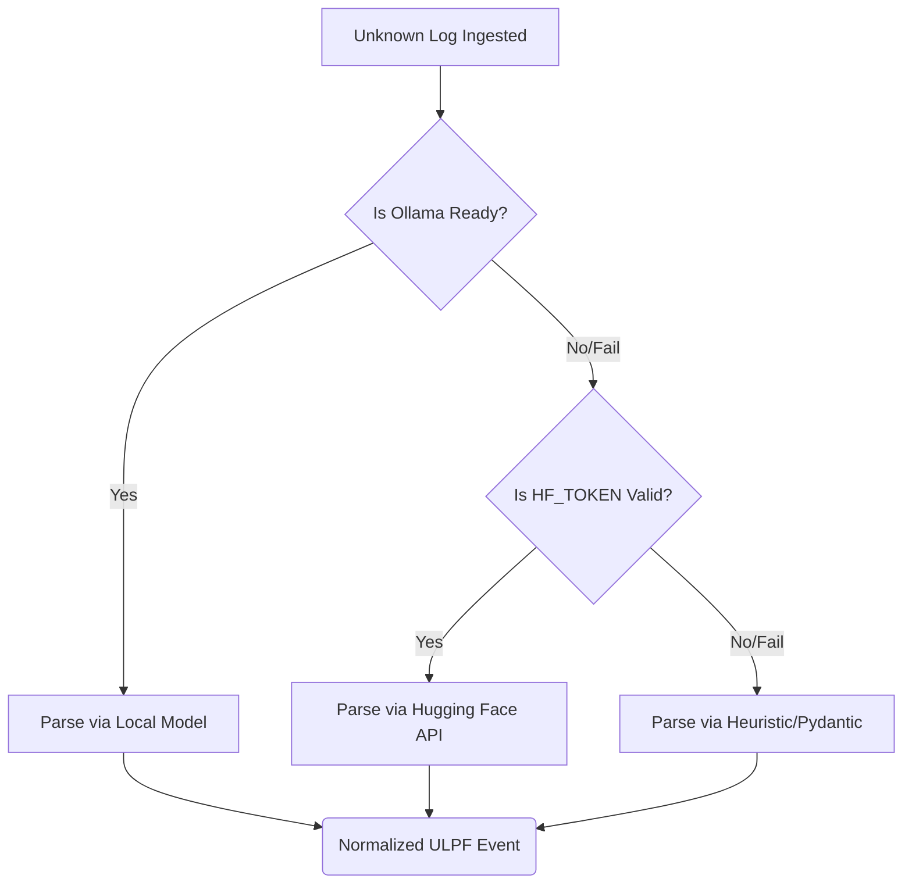

# ULPF — Real-World Log Collection & Working Guide

## How ULPF Actually Collects and Processes Logs

This document describes how ULPF collects real logs from connected devices and from users, who it benefits, and what types of logs can be sent.

---

## Log Collection Methods

### 1. Syslog from Connected Network Devices (Automatic Collection)

Network devices like firewalls, routers, switches, wireless access points, and VPN gateways can be configured to send their logs directly to ULPF via the **Syslog protocol**.



**How to configure a device to send logs to ULPF:**

#### Cisco ASA Firewall
```
logging host inside 192.168.1.100 udp/5140
logging trap informational
logging enable
```

#### Fortinet FortiGate
```
config log syslogd setting
    set status enable
    set server "192.168.1.100"
    set port 5140
end
```

#### Linux Server (rsyslog)
```bash
# /etc/rsyslog.d/ulpf.conf
*.* @192.168.1.100:5140    # UDP
*.* @@192.168.1.100:5141   # TCP
```

#### Meraki WiFi Access Point
```
Dashboard > Network-wide > General > Reporting > Syslog servers
Add server: 192.168.1.100, Port: 5140, Roles: All
```

#### Windows Server (via NXLog)
```xml
<Output ulpf>
    Module      om_udp
    Host        192.168.1.100
    Port        5140
</Output>
```

**What happens:** Once configured, the device continuously streams its logs to ULPF's syslog collector. ULPF receives each message, auto-detects the format, parses it, normalizes it, and stores it — all in real-time with zero human intervention.

---

### 2. REST API — User-Sent Logs (Manual / Programmatic)

Users and applications can send logs directly to ULPF via HTTP POST requests.

**Single Log Submission:**
```bash
curl -X POST http://localhost:8000/api/v1/ingest \
  -H "Content-Type: application/json" \
  -d '{
    "source": "web-server-01",
    "message": "2026-09-11T14:30:00Z INFO [auth] User admin@company.com logged in from 203.0.113.50 via SSO"
  }'
```

**Batch Log Submission:**
```bash
curl -X POST http://localhost:8000/api/v1/ingest/batch \
  -H "Content-Type: application/json" \
  -d '{
    "source": "security-scanner",
    "logs": [
      "<134>Sep 11 14:30:00 fw01 %ASA-6-302013: Built inbound TCP connection",
      "CEF:0|CrowdStrike|Falcon|6.0|1001|Malware Detected|9|src=10.0.0.50 fname=trojan.exe",
      "{\"timestamp\": \"2026-09-11T14:30:00Z\", \"level\": \"ERROR\", \"service\": \"payment-api\", \"message\": \"Transaction timeout\"}"
    ]
  }'
```

**File Upload:**
```bash
curl -X POST http://localhost:8000/api/v1/upload \
  -F "file=@/var/log/auth.log"
```

**Python SDK Example:**
```python
import requests

log_data = {
    "source": "iot-gateway-01",
    "vendor": "Cisco",
    "product": "Meraki",
    "message": "1725619200.123456789 AP-Office-3F events type=association radio=1 vap=0 channel=36 rssi=42 aid=1234 mac=AA:BB:CC:DD:EE:FF"
}

response = requests.post("http://localhost:8000/api/v1/ingest", json=log_data)
result = response.json()

print(f"Event ID: {result['event_id']}")
print(f"Detected Format: {result['detected_format']}")
print(f"Status: {result['status']}")
```

---

### 3. File Tail Collector (Automatic File Monitoring)

ULPF monitors the `storage/logs/` directory for `.log` files. Any new lines appended to files in this directory are automatically ingested.

```bash
# Drop a log file into the watched directory — ULPF picks it up automatically
cp /var/log/nginx/access.log /path/to/ulpf/storage/logs/

# Or pipe logs directly
echo '<134>Sep 11 14:30:00 fw01 Connection blocked src=10.0.0.1 dst=192.168.1.1' >> /path/to/ulpf/storage/logs/firewall.log
```

---

### 4. Redpanda / Kafka Streaming (High-Throughput)

For high-volume environments, logs can be published to the `ulpf-raw-ingress` Kafka topic. ULPF consumes and processes them at scale.

```python
from kafka import KafkaProducer
import json

producer = KafkaProducer(
    bootstrap_servers='localhost:19092',
    value_serializer=lambda v: json.dumps(v).encode('utf-8')
)

producer.send('ulpf-raw-ingress', {
    'source': 'cloud-firewall',
    'raw_message': 'CEF:0|AWS|WAF|1.0|BLOCK|SQL Injection|9|src=198.51.100.42 request=/api/login?user=admin%27--'
})
```

---

## What Types of Logs Can Users Send?

ULPF accepts **any log format** from **any source**. Here are the specific formats it can auto-detect and parse:

### Fully Supported Log Formats

| Format | Example Source | Sample Log |
|--------|---------------|------------|
| **Syslog (RFC 3164)** | Cisco ASA, FortiGate, Linux | `<134>Oct 5 14:33:27 fw01 %ASA-6-302013: Built inbound TCP connection for outside:198.51.100.42/443` |
| **Syslog (RFC 5424)** | Modern network devices | `<165>1 2026-09-11T14:30:00Z router01 sshd 12345 - - Failed password for root from 10.0.0.1` |
| **CEF (Common Event Format)** | ArcSight, CrowdStrike, Fortinet | `CEF:0\|Fortinet\|FortiGate\|7.0\|12345\|Blocked\|8\|src=10.0.0.1 dst=192.168.1.1 act=BLOCK` |
| **LEEF (Log Event Extended Format)** | IBM QRadar, Guardium | `LEEF:2.0\|IBM\|QRadar\|7.5\|PolicyViolation\|src=10.0.0.1\|dst=192.168.1.1\|sev=8` |
| **JSON** | Cloud services, APIs, containers | `{"timestamp": "2026-09-11T14:30:00Z", "level": "ERROR", "src_ip": "10.0.0.1"}` |
| **XML** | Windows Event Log, SOAP services | `<Event><System><EventID>4625</EventID></System><Data>Logon Failure</Data></Event>` |
| **CSV** | Database exports, SIEM exports | `2026-09-11,14:30:00,10.0.0.1,192.168.1.1,BLOCK,HIGH` |
| **Key=Value** | Custom applications, WAFs | `timestamp=2026-09-11T14:30:00 src=10.0.0.1 dst=192.168.1.1 action=deny severity=high` |
| **Plaintext** | Any unknown format | `Connection blocked from 198.51.100.42 to internal server 10.0.1.100 on port 443` |

### Real-World Log Examples by Device Type

#### WiFi / Wireless Access Point Logs
```
# Meraki WiFi Event
1725619200.123456789 AP-Office-3F events type=disassociation radio=1 vap=0 channel=36 rssi=28 aid=5678 mac=AA:BB:CC:DD:EE:FF reason=8

# Aruba WiFi
<134>Sep 11 14:30:00 aruba-ctrl authd[1234]: <522038> User 'jsmith' authenticated via 802.1X on SSID 'CorpWiFi' MAC AA:BB:CC:DD:EE:FF IP 10.0.5.42
```

#### Firewall Logs
```
# Cisco ASA
<134>Sep 11 14:30:00 fw01 %ASA-4-106023: Deny tcp src outside:198.51.100.42/443 dst inside:10.0.1.100/52341 by access-group "OUTSIDE" [0x0, 0x0]

# Palo Alto
TRAFFIC,2026/09/11 14:30:00,012345678901,DENY,trust,untrust,10.0.0.1,198.51.100.42,HTTP-proxy,vsys1,80,443,tcp
```

#### Server Logs
```
# Apache Access Log
198.51.100.42 - - [11/Sep/2026:14:30:00 +0000] "GET /api/v1/users HTTP/1.1" 200 1234

# Nginx Error Log
2026/09/11 14:30:00 [error] 1234#0: *5678 connect() failed (111: Connection refused) while connecting to upstream

# SSH Auth Log
Sep 11 14:30:00 server01 sshd[12345]: Failed password for invalid user admin from 198.51.100.42 port 22 ssh2
```

#### Cloud Service Logs
```json
{
  "eventVersion": "1.08",
  "eventSource": "signin.amazonaws.com",
  "eventName": "ConsoleLogin",
  "sourceIPAddress": "198.51.100.42",
  "userAgent": "Mozilla/5.0",
  "responseElements": {"ConsoleLogin": "Failure"}
}
```

#### Application Logs
```
# Spring Boot
2026-09-11 14:30:00.123 ERROR [payment-service,abc123,def456] --- PaymentController: Transaction timeout for order #98765

# Docker Container
{"log":"2026-09-11T14:30:00Z ERROR Database connection pool exhausted\n","stream":"stderr","time":"2026-09-11T14:30:00.123Z"}
```

#### IoT / SCADA / Industrial
```
[SCADA_V2] UNIT=Substation-4 NODE=10.240.12.5 CMD=RELAY_TRIP SENSOR=TEMP_OVERHEAT VAL=88.4C TS=20260911-143000
```

---

## Who Benefits and How

### 1. Security Analysts (SOC Tier 1/2/3)

**Problem:** Analysts must learn different log formats for each vendor — Cisco logs look completely different from Fortinet logs, which look completely different from AWS CloudTrail logs.

**How ULPF helps:**
- All logs are normalized into a single schema with consistent field names (source.ip, destination.ip, event.action, severity)
- Analysts can search across all vendors using one query instead of writing vendor-specific searches
- Real-time threat alerts surface critical events immediately without manual log review
- MITRE ATT&CK mapping connects raw log events to known attack techniques

**Example:** Instead of learning that Cisco uses `%ASA-4-106023` for deny events and Fortinet uses `action=deny`, the analyst just searches for `event.action = deny` across all sources.

---

### 2. Incident Response Teams

**Problem:** During a breach, the IR team must rapidly collect, preserve, and analyze logs from dozens of different systems — each with its own format and timestamp convention.

**How ULPF helps:**
- SHA-256 cryptographic hashing of every raw log provides tamper-proof evidence
- Field provenance tracking creates a court-admissible chain of custody
- Three-tier storage ensures raw evidence is preserved immutably in MinIO
- Normalized timestamps enable cross-system timeline reconstruction
- OCSF export provides a standard format accepted by forensic tools

**Example:** The IR team can export all events from a 24-hour window, filtered by a suspected attacker IP, in OCSF format — ready for legal proceedings.

---

### 3. Compliance Officers and Auditors

**Problem:** Regulations like PCI-DSS, HIPAA, SOX, and GDPR require centralized log monitoring with standardized reporting across all systems.

**How ULPF helps:**
- All logs stored in a consistent format regardless of source vendor
- Retention policy (configurable, default 30 days) supports compliance requirements
- Audit logging middleware records who accessed the system and when
- ECS export integrates directly with Elastic-based compliance dashboards
- Event provenance provides auditors with complete data lineage

---

### 4. IT Operations / DevOps Teams

**Problem:** When a production service goes down, the on-call engineer must check logs from the application, the database, the load balancer, the firewall, and the cloud provider — each in a different format and location.

**How ULPF helps:**
- Single dashboard view of all system events
- Real-time SSE streaming shows events as they happen
- Batch ingestion API enables CI/CD pipelines to send deployment logs
- File upload enables quick ad-hoc log analysis during incidents

---

### 5. MSSP / Managed Security Service Providers

**Problem:** MSSPs manage security for multiple clients, each with different device vendors and log formats.

**How ULPF helps:**
- Universal ingestion means any client's devices can be onboarded in minutes
- AI-powered parser synthesis handles unknown/proprietary formats automatically
- Standardized OCSF/ECS output feeds into the MSSP's central SIEM regardless of client vendor mix

---

### 6. Network Administrators

**Problem:** Network admins need to troubleshoot connectivity issues, WiFi problems, and VPN failures using logs from multiple device vendors.

**How ULPF helps:**
- WiFi association/disassociation events from Meraki, Aruba, Cisco WLC are all normalized
- VPN connection logs from Palo Alto, Cisco AnyConnect, FortiClient are unified
- Syslog collector receives logs directly from network devices with zero agent installation

**Example — WiFi troubleshooting:**
An admin investigating intermittent WiFi drops can see all association/disassociation events across all access points in a single timeline, filtered by MAC address or SSID, regardless of whether the APs are Meraki, Aruba, or Cisco.

---

## Real Device Log Collection Flow



## User-Sent Log Collection Flow



---

## AI Onboarding & Cascading Fallback Architecture

A core innovation of ULPF is its ability to handle completely unknown or proprietary log formats dynamically. Instead of failing, ULPF triggers its **AI Onboarding Engine** to synthesize a parser on the fly. 

To ensure 100% uptime and resilience against outages (e.g. rate limits, disconnected local instances), ULPF utilizes a **Cascading 3-Step Model Fallback**:

1. **Step 1: Local Model (Ollama)**
   - The engine first attempts to use a local, air-gapped Small Language Model (SLM) such as `qwen2.5:7b` running on the internal network. This ensures data sovereignty and zero API costs.
   - If the local daemon is unreachable or the model is unloaded, it safely proceeds to Step 2.

2. **Step 2: API Key Model (Hugging Face)**
   - The system falls back to an external serverless Inference API using an injected `HF_TOKEN`. It queries `Qwen/Qwen2.5-7B-Instruct` on Hugging Face to generate the parser schema. 
   - If the API call times out, encounters a rate limit, or the API key is missing/invalid, it proceeds to Step 3.

3. **Step 3: Default (Pydantic / Heuristic Logic)**
   - The ultimate fallback is a completely deterministic, non-LLM heuristic provider. It uses fast regex and structured Pydantic models to construct a basic, valid schema, ensuring the log is processed, categorized, and stored securely without dropping data.



---

## What Logs the User Sends

Users can send **any text-based log** to ULPF. Common categories include:

| Category | Examples | Why Send It |
|----------|----------|-------------|
| **Firewall logs** | Cisco ASA, Fortinet, Palo Alto deny/allow events | Track blocked connections, detect intrusion attempts |
| **WiFi logs** | Meraki, Aruba, Cisco WLC association/authentication events | Troubleshoot connectivity, detect rogue devices |
| **VPN logs** | AnyConnect, GlobalProtect login/logout events | Monitor remote access, detect credential theft |
| **Server logs** | Apache/Nginx access logs, SSH auth logs | Detect brute force attacks, track access patterns |
| **Application logs** | JSON/structured logs from microservices | Debug errors, trace transactions, monitor SLA |
| **Cloud audit logs** | AWS CloudTrail, Azure Activity Log, GCP Audit Log | Compliance monitoring, detect configuration drift |
| **Database logs** | MySQL/PostgreSQL query logs, audit logs | Detect SQL injection, monitor privileged access |
| **Endpoint logs** | CrowdStrike, Carbon Black, Windows Defender alerts | Track malware detection, endpoint compromise |
| **IoT/OT logs** | SCADA telemetry, sensor data, PLC events | Monitor industrial systems, detect anomalies |
| **Custom app logs** | Any proprietary or custom format | ULPF's AI can auto-generate a parser for unknown formats |

### Minimum Required Fields

The only required field is the **raw log message itself**. ULPF will auto-detect and extract everything else. However, users can optionally provide:

```json
{
  "message": "<the raw log text>",        // REQUIRED
  "source": "device-name-or-id",          // Optional: helps with source tracking
  "vendor": "Cisco",                       // Optional: hints for parser selection
  "product": "ASA"                         // Optional: hints for parser selection
}
```

Or simply send raw text:
```bash
curl -X POST http://localhost:8000/api/v1/ingest \
  -H "Content-Type: text/plain" \
  -d '<134>Sep 11 14:30:00 fw01 %ASA-6-302013: Built inbound TCP connection'
```

---

*ULPF v1.0.0 — Universal Log Pre-processing Framework*
*SIH Problem SIH 26156 — Smart India Hackathon 2026*
